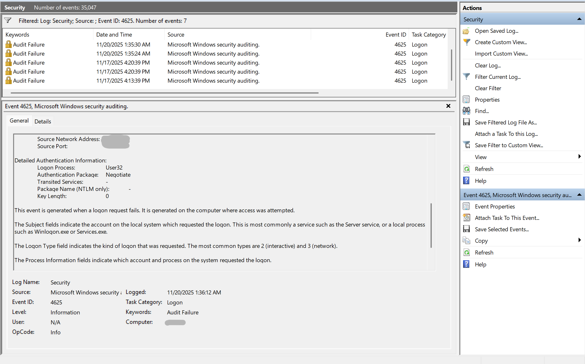

# 🛡️ Windows Log Analysis & SOC Simulation

Simulated suspicious activity on a Windows 11 Home system to generate audit logs for SOC-style analysis. This project demonstrates audit policy configuration, attacker behavior simulation, log export and parsing, MITRE ATT&CK mapping, and SOC-style alert generation.

---

## 🎯 Objectives

- Enable audit logging via PowerShell (Home Edition workaround)
- Simulate attacker behavior (failed logins, PowerShell misuse, privilege escalation)
- Export and parse Windows Security logs
- Map events to MITRE ATT&CK techniques
- Generate SOC-style alerts and incident report

---

## 🧪 Simulated Events

| Event ID | Description                      |  MITRE Technique         |
|----------|----------------------------------|--------------------------|
| 4625     | Failed logon attempt             | T1110 (Brute Force)      |
| 4688     | Process creation (PowerShell)    | T1059.001 (PowerShell)   |
| 4672     | Privileged logon (SYSTEM)        | T1078 (Valid Accounts)   |
| 4104     | PowerShell script block logging  | T1059 (Script Execution) |

---

## 🛠️ Setup & Execution


### 🔐 Enable Audit Policies

```powershell
auditpol /set /subcategory:"Logon" /success:enable /failure:enable
auditpol /set /subcategory:"Credential Validation" /success:enable /failure:enable
auditpol /set /subcategory:"Process Creation" /success:enable
auditpol /set /subcategory:"Special Logon" /success:enable
```

### 🧨 Simulate Suspicious Activity

```powershell
Invoke-WebRequest -Uri "https://raw.githubusercontent.com/PowerShellMafia/PowerSploit/master/Recon/Invoke-TokenManipulation.ps1" -OutFile "Invoke-TokenManipulation.ps1"
Set-MpPreference -DisableRealtimeMonitoring $true
Start-Process powershell.exe
whoami /priv
```

### 📤 Export Logs

```powershell
Get-WinEvent -FilterHashtable @{LogName='Security'; ID=4625,4688,4672} | Export-Csv -Path .\eventlog.csv
```

## 🚨 Sample SOC Alerts

### 🔐 Failed Logon Attempt
• 	Event ID: 4625
• 	MITRE ATT&CK: T1110 (Brute Force)
•   
• 📸 Event 4625 – Failed Logon  
• Shows a failed login attempt. Sensitive details have been blurred.


### 🧨 Suspicious PowerShell Execution
• 	Event ID: 4688
• 	Process: powershell.exe
• 	MITRE ATT&CK: T1059.001 (PowerShell)

### 🛡️ Privileged Logon
• 	Event ID: 4672
• 	Account: SYSTEM
• 	MITRE ATT&CK: T1078 (Valid Accounts)

### 📁 Artifacts
• 	 — exported logs
• 	 — full incident write-up
• 	Screenshots of Event Viewer entries
• 	MITRE mapping references

### 🧠 Skills Demonstrated
• 	Windows audit policy configuration
• 	PowerShell scripting and simulation
• 	Log parsing and triage
• 	MITRE ATT&CK mapping
• 	SOC alert generation
• 	Incident reporting and documentation

### ✍️ Author
Chidarikire T.
Cybersecurity Graduate | Threat analyst in training


4625 Simulated failed logon event (Event ID 4625) captured during SOC workflow testing. All data shown is from a controlled lab environment.


